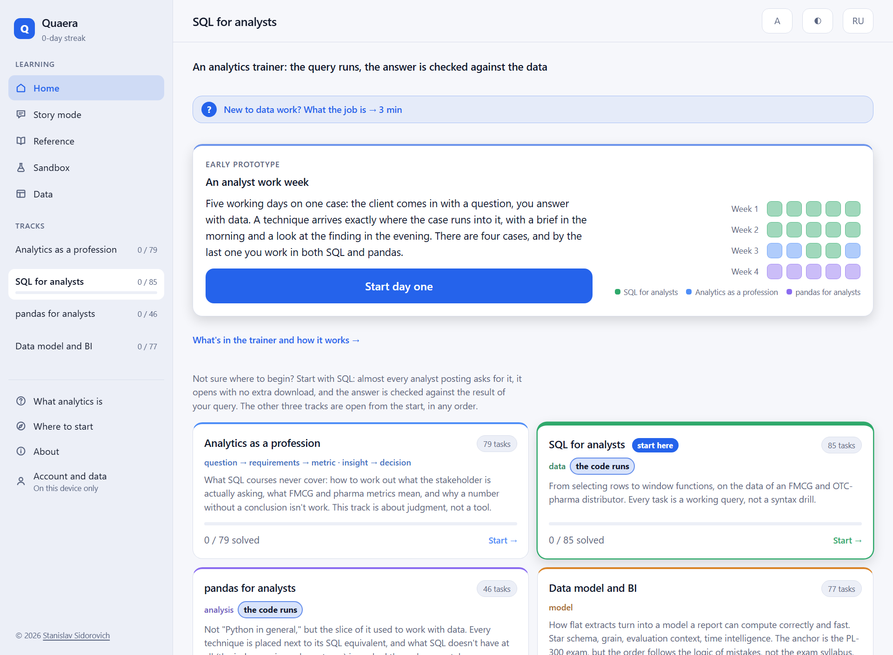
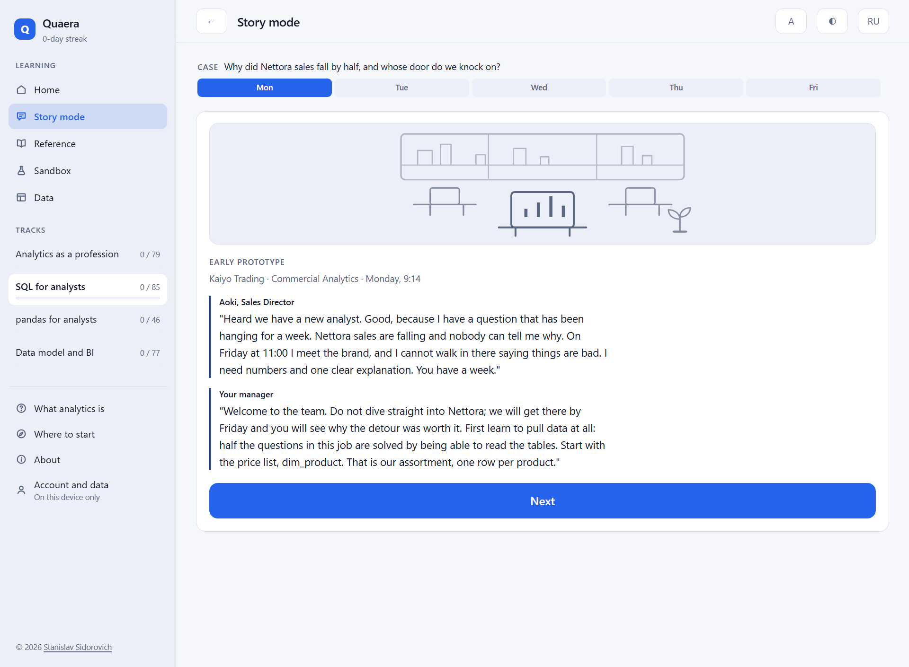
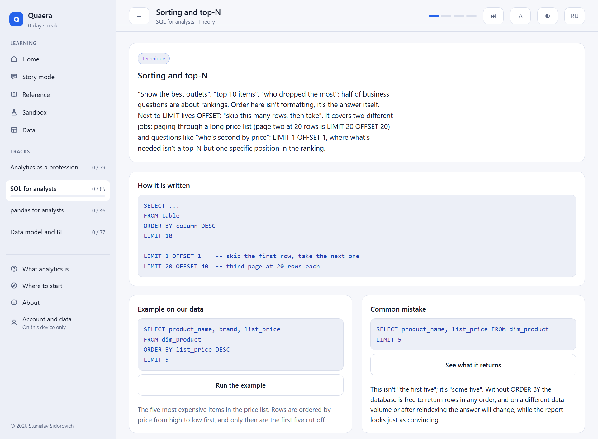
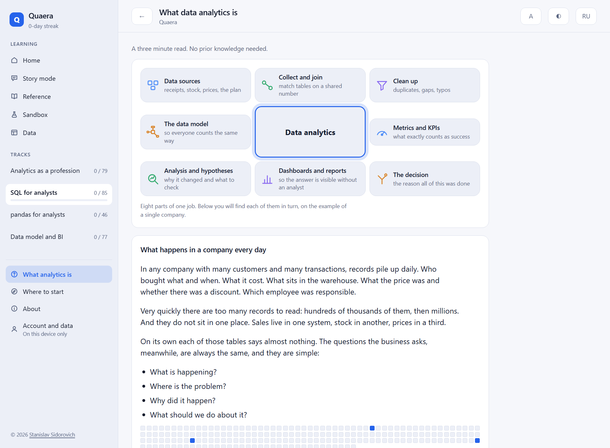
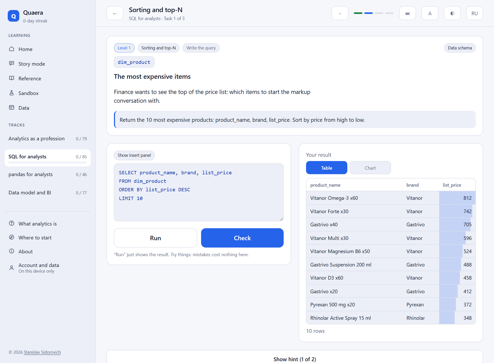
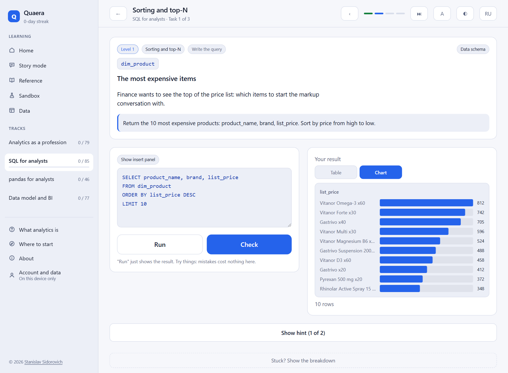
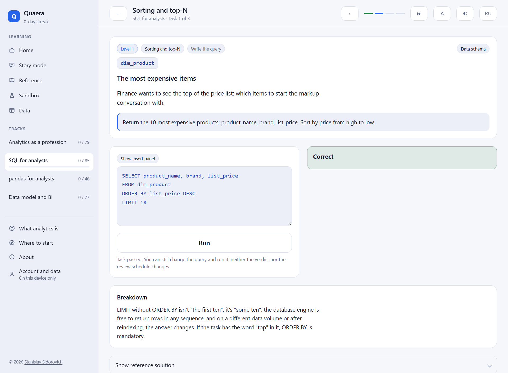
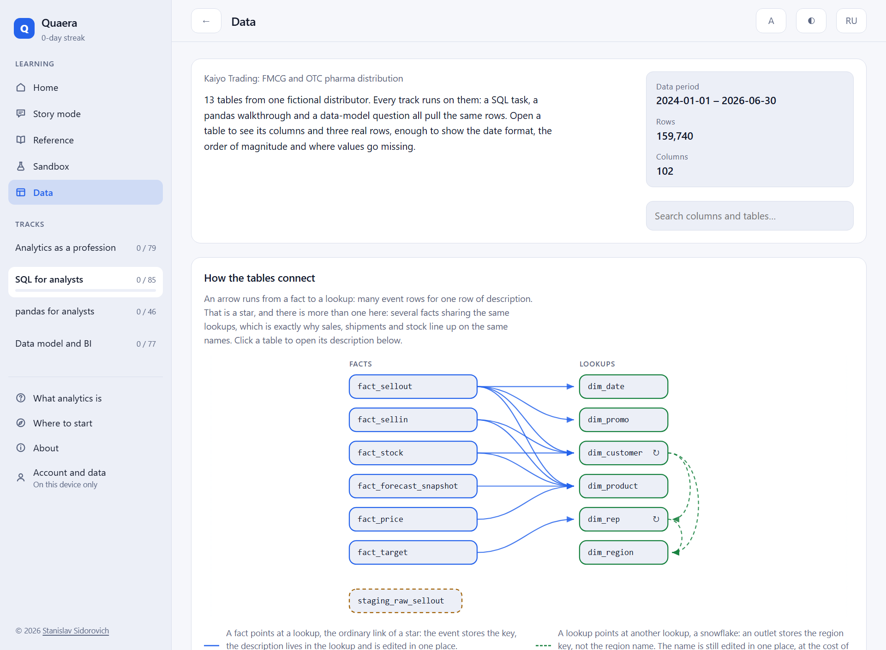

[English](README.md) | Русский

# Quaera — тренажёр аналитика данных

**Открываете ссылку и через минуту пишете настоящий запрос к базе вымышленного
дистрибьютора: ищете, почему упал бренд, и сразу видите, сошёлся ли ответ
с данными.** Ставить ничего не нужно, регистрации нет, на телефоне работает
и без интернета.

**[Открыть приложение → quaera.app](https://quaera.app)**

Если словосочетание «аналитика данных» вам ничего не говорит, начните отсюда:
**[Что такое аналитика данных](https://quaera.app/?intro)** — экскурс на три
минуты, написанный без единого профессионального термина.

Технически это мобильное веб-приложение (PWA) для практики SQL, pandas, модели
данных и суждения аналитика на данных, похожих на рабочие. Код исполняется
по-настоящему: SQLite и Python (Pyodide) работают целиком в браузере, без
сервера.

## Что посмотреть за три минуты

| Кто вы | Куда смотреть |
| --- | --- |
| С данными не работаете | [Что такое аналитика данных](https://quaera.app/?intro) — что это за профессия и где она нужна, без терминов |
| Учите SQL или pandas | [quaera.app](https://quaera.app), трек SQL: 3.5 МБ базы, поднимается за несколько секунд и дальше работает офлайн |
| Аналитик — или нанимаете аналитика | [Kaiyo Trading: three findings and what they cost](docs/analysis/kaiyo-trading.en.md) — разбор датасета, написанный как рабочий документ аналитика |
| Пришли посмотреть код | [Как это устроено](#как-это-устроено) ниже и [ROADMAP.md](ROADMAP.md): что проверяется гейтом автоматически, а что требует ручной экспертизы |



## Что внутри

**Четыре трека — 272 задания и 72 навыка.** Наполнены целиком, вычитаны
и переведены на английский: интерфейс, задания, карточки приёмов.

| Трек | Заданий | Навыков | Как проверяется ответ |
| --- | --- | --- | --- |
| SQL для аналитика | 84 | 19 | Запрос выполняется в SQLite (sql.js) |
| Аналитика как профессия | 79 | 20 | Выбор варианта с разбором (`predict`) и расстановка шагов рассуждения по порядку (`order`) |
| Модель данных и BI | 63 | 19 | Выбор варианта с разбором (`predict`) |
| pandas для аналитика | 46 | 14 | Код выполняется в Python (Pyodide) |

**Режим истории — рабочая неделя аналитика.** Четыре недели по пять дней,
двадцать дней: утром заказчик приходит с вопросом, вечером вы приносите
находку. Приёмы вводятся ровно там, где дело в них упирается, а не по
программе курса, и неделя умеет менять трек между днями — третья ходит
между профессией и SQL, четвёртая идёт на pandas. Помечен в интерфейсе как
ранний прототип: кампания написана, а отдельная сюжетная линия, проходящая
через целый трек, прозой закрыта только для SQL.



**Карточка приёма — перед первой задачей на новый навык**, а не курс, который
листают заранее: форма записи, пример на данных дистрибьютора, частая ошибка.



Кроме треков в приложении есть:

- **Справочник приёмов** — все карточки отдельным экраном, с примером,
  который можно выполнить прямо в карточке, не открывая задание;
- **Песочница** — свободный режим на тех же данных: любой запрос, без задания
  и без подсказок, со списком вопросов рядом, если спросить нечего;
- **Экран «Данные»** — схема из 13 таблиц с гранулярностью и числом строк,
  посчитанными от настоящего датасета, а не вписанными руками;
- **Повторение и напоминания** — интервальный планировщик и push-уведомление,
  когда тему пора повторить;
- **Синхронизация — по желанию.** Без входа прогресс живёт в браузере
  и о вас на сервере нет ни строки; вход нужен ровно для одного — перенести
  прогресс на второе устройство.

Есть и отдельный экран для тех, кто про эту профессию ничего не знает: что
делают с данными в компании, зачем для этого отдельные инструменты и где так
работают. Его можно отправить ссылкой знакомому, не объясняя ничего голосом.



## Чем это отличается от других тренажёров

Не количеством задач, а четырьмя вещами.

**1. Один связный датасет вместо учебных табличек.** Вымышленный дистрибьютор
FMCG и OTC-фармы «Kaiyo Trading», звезда из 13 таблиц, 160 тысяч строк
за два с половиной года. Данные согласованы: sell-out агрегируется в sell-in,
sell-in минус sell-out даёт остатки, планы построены от факта. Все четыре
трека работают на одних и тех же цифрах — падение бренда из-за потери
дистрибуции разбирается запросом, датафреймом, мерой DAX и рассуждением,
и ответы обязаны сходиться.

**2. Диагностика вместо вердикта.** Ответ сравнивается по результату,
а не по тексту запроса, и по форме расхождения восстанавливается вероятная
причина: размножение строк соединением, потерянный фильтр периода, INNER
вместо LEFT, забытый ORDER BY, опечатка в имени колонки.

<table>
<tr>
<td width="50%">

**Задание — реальный запрос к реальной базе.** Условие, редактор с панелью
токенов под палец, переключатель «Таблица / График» у результата.



</td>
<td width="50%">

**Тот же результат — графиком.** Переключатель появляется только там, где
строить график честно (см. «Как это устроено» → `chartSpec`), а не всегда.



</td>
</tr>
<tr>
<td width="50%">

**Проверка исполнением, а не текстом.** Любой запрос с тем же результатом
принимается; ответ сверяется по данным, которые он вернул.



</td>
<td width="50%">

**Схема данных — не текст, а живые числа.** Гранулярность и число строк
каждой таблицы посчитаны от реального датасета, а не вписаны вручную.



</td>
</tr>
</table>

**3. У каждого утверждения — источник.** Числа, которые задание цитирует
в тексте (предсказание результата запроса, метрики бизнеса в domain, значение
меры в model), заранее сверены с датасетом и защищены отдельной проверкой
в гейте сборки — см. «Сюжеты в данных» ниже.

**4. Код исполняется на телефоне.** SQLite и pandas работают в Web Worker
прямо в браузере, включая офлайн, без сервера — обычно это ограничение
десктопных инструментов.

## Сюжеты в данных

Задачи опираются не на случайные числа, а на заложенные ситуации:

- бренд «Nettora» падает вдвое — не из-за спроса и не из-за цены,
  а потому что его перестали брать больше половины точек;
- дистрибьютор «Setouchi Trading» затарил склад в Q4 2025: отношение sell-in
  к sell-out подскочило с обычных 1.04 до 2.44, вернулось к норме за два
  квартала — а остатки на складе выросли впятеро и не снизились: поток
  восстановился, уровень остался (различие потока и запаса — dom-021);
- разнонаправленная сезонность: вода летом, витамины и жаропонижающие зимой —
  один и тот же переход месяца даёт то +316%, то +36%, то +3.2% в зависимости
  от базы сравнения (dom-025);
- систематический перекос планирования: план по выручке выполняют 3–7
  торговых представителей из 25 каждый месяц полугодия — распределение
  выдаёт дефект норматива, которого не видно в среднем проценте (dom-022);
- запуск «Vitanor Forte» в сентябре 2025 с постепенной раскаткой дистрибуции;
- отсутствие строки в `fact_sellout` означает «не продавалось», а не ноль;
- `staging_raw_sellout` — сырой слой с дублями, NULL, датами в четырёх
  форматах и одной сетью в двух написаниях;
- одна дата в двух ролях: заказ и отгрузка в `fact_sellin` расходятся
  на 2–11 дней, и 1979 заказов из 15 362 переезжают отгрузкой в следующий
  месяц — ровно тот случай, где для модели данных нужны активная
  и неактивная связь к одному календарю, а не два (mdl-031, mdl-032).

Три из них разобраны до конца и сведены в один документ —
**[Kaiyo Trading: three findings and what they cost](docs/analysis/kaiyo-trading.en.md)**
(на английском). Приложение показывает, как задавать вопросы данным; этот
разбор показывает, как на них отвечают: вопрос → что показали данные →
что это значит → что делать → чего это стоит, с проверкой альтернативных
объяснений и ценой каждой находки в деньгах.

`npm run verify:data` проверяет, что все они на месте: если правка генератора
убьёт сюжет, эталонные ответы к заданиям молча разъедутся с реальностью.
Для чисел, которые задание цитирует в тексте (а не только в исполняемом
эталоне — так устроены все задания в `domain` и `model`), в
`verify-content.mjs` есть отдельные проверки по каждому такому заданию:
гейт проверяет не только «запрос выполняется», но и «текст не разошёлся
с базой».

---

Дальше — для тех, кто открывает код: как поднять локально, из чего собрано
приложение, как устроен деплой и как добавить задание.

## Запуск

```bash
npm install && npm run prepare:assets && npm run dev
```

`prepare:assets` копирует рантаймы sql.js и Pyodide, рисует иконки
и генерирует датасет — без него приложение не поднимется. Открыть
с телефона можно по адресу из вывода Vite (`--host` включён), там же
ставится на домашний экран.

| Команда | Что делает |
| --- | --- |
| `npm run dev` | Дев-сервер |
| `npm run build` | Проверка типов, продакшен-сборка, service worker |
| `npm run gen:data` | Пересобрать датасет |
| `npm run verify` | Все 15 гейтов: датасет, контент, планировщик повторений, слияние прогресса, правила графика, раскладка схемы, английская проза, сверка текстом для DAX, миграция хранилища, сверка двух исполнителей, расписание push-напоминаний, ширина колонок в CSS, сюжетная линия, лестница режима истории и жанр блоков в карточке приёма |

### Если форкаете: аккаунт и синхронизация

Вход через Google и синхронизация прогресса работают через Supabase.
Publishable-ключ и адрес проекта лежат в коде открыто (`src/sync/client.ts`) —
это не недосмотр: такой ключ попадает в бандл при любом способе хранения,
а защищает не он, а RLS (`supabase/migrations/0001_progress.sql`, доступ
только к строке с собственным `auth.uid()`).

**Форку нужно заменить обе константы своими**, иначе чужая копия будет
писать в базу автора. Кроме того, кнопка удаления аккаунта вызывает
Edge Function `delete-account`, которой **в репозитории нет** — она требует
`service_role`-ключ, который нельзя класть в браузер, и была выложена через
редактор дашборда Supabase. Без неё всё остальное работает; удаление
аккаунта — нет.

## Как это устроено

```
scripts/build-dataset.mjs   генератор датасета (детерминированный seed)
scripts/verify-dataset.mjs  проверка, что сюжеты в данных на месте
scripts/verify-content.mjs  проверка, что все эталоны исполняются
public/sql-worker.js        SQLite в Web Worker: исполнение и сверка с эталоном
public/python-worker.js     Pyodide+pandas в Web Worker, тот же контракт
public/sw.js                офлайн-кеш
src/engine/                 клиенты воркеров, типы, диагностика ошибок
src/content/                типы контента, паки заданий и их переводы (JSON)
src/i18n/                   строки интерфейса (ru/en) — отдельно от контента
src/srs/                    планировщик повторений и локальный прогресс
src/ui/                     мобильные компоненты
```

Три решения, на которых держится всё остальное:

**Контент — данные, не код.** Задание описывается JSON-объектом. Приложение —
плеер: оно ничего не знает про конкретные задачи. Один и тот же формат
работает и для треков с исполнителем (`sql`, `python`, эталон проверяется
запуском), и для треков без него (`domain`, `model`, единственный допустимый
режим — `predict`, ответ — выбор варианта с разбором). Пак пополняется
без релиза приложения.

**Сверка исполнением.** Там, где есть исполнитель, запрос или код выполняется
на реальной базе и сравниваются результирующие наборы, а не текст решения.
Любое корректное решение принимается, а расхождение даёт материал
для содержательной подсказки.

**Интервал назначается навыку, а не заданию.** Человек, решивший задачу
про топ-3 SKU, запомнил не её, а приём «оконная функция в CTE, фильтр
снаружи». Повторять нужно приём — и лучше на другой задаче, иначе
тренируется память на текст условия.

### Почему PWA, а не нативное приложение

Единственный вариант, в котором в одном приложении уживаются SQLite (sql.js)
и Python с pandas (Pyodide) — оба целиком в браузере, без сервера. Плюс
установка на домашний экран без сторов и мгновенные обновления. Упаковать
в Capacitor и отнести в сторы можно позже без переписывания.

### Почему датасет весит 12 МБ

По сети идёт 3.5 МБ (gzip), один раз, дальше — из кеша service worker'а.
Меньший объём не позволил бы задачам быть похожими на рабочие: на тысяче
строк не видно ни сезонности, ни разницы между `COUNT(*)` и `COUNT(DISTINCT)`.

Файл называется `quaera.dataset`, а не `*.gz`, хотя внутри именно gzip.
Менеджеры загрузок (IDM, FDM) перехватывают известные архивные расширения,
и страница получает пустой ответ вместо данных. Сжатие определяется
по сигнатуре первых байт, поэтому имя файла роли не играет — а заодно
снимается зависимость от того, проставит ли хостинг заголовок
`Content-Encoding`.

### Почему Pyodide грузится по согласию, а не сразу

Рантайм Python с pandas весит около 52 МБ — на порядок больше датасета.
Трек `pandas` показывает экран согласия перед первой загрузкой и объясняет
цену; отказаться можно и продолжить пользоваться картой навыков
и справочником без него. SQL и остальные треки этого экрана не видят.

## Деплой

Хостинг — Cloudflare Pages, подключённый к этому репозиторию. Настройки
сборки:

| Параметр | Значение |
| --- | --- |
| Build command | `npm run prepare:assets && npm run build` |
| Build output directory | `dist` |
| Node version | из `.node-version` |

Датасет в репозитории не хранится — он генерируется на сборке из
`scripts/build-dataset.mjs` по фиксированному seed, поэтому на хостинге
получается тот же файл байт в байт. `_headers` и `_redirects` из `public/`
Cloudflare подхватывает сам. Деплой автоматический на каждый push в `main`.

Service worker регистрируется только в продакшен-сборке, так что офлайн-режим
проверяется на боевом адресе или через `npm run build && npm run preview`,
но не в `npm run dev`.

## Как добавить задание

Дописать объект в пак нужного трека (`src/content/packs/<track>-core.json`)
и прогнать `npm run verify:content`. Проверка не пропустит задание, у которого
эталон не выполняется, возвращает пустоту, содержит колонку без алиаса,
требует сортировки без `ORDER BY` или ссылается на несуществующий навык.
У задания в режиме `predict` должен быть ровно один верный вариант, и у
каждого варианта — разбор, почему его выбирают.

Треки без исполнителя кода (`domain`, `model`) работают только в режиме
`predict`: вместо `predictSql` там поле `scenario` — бизнес-ситуация вместо
запроса или готовой меры, гейт требует ровно одно из двух. Пак может быть
наполнен частично: карточка теории и проверка гейтом требуются только для
навыков, у которых уже есть хотя бы одно задание, а не на весь граф разом —
так трек можно вести батчами, не блокируя выдачу уже готовых тем.

**Перевод на английский** — параллельный файл (`sql-core.json` →
`sql-core.en.json`), а не поля внутри задания: так перевод не удваивает
стоимость каждого батча контента немедленно. Мёрджится по id поверх
русского пака в рантайме (`applyTranslation` в `src/content/index.ts`);
задания без перевода остаются русскими, а не ломают сборку. Код —
`solution`, `predictSql`, `starter`, `template` — не переводится и не
дублируется вовсе: это уже исполняемый и проверенный гейтом текст,
включая кириллические значения датасета (бренды, города), которые
одинаковы на любой локали.

## Автор и лицензия

Станислав Сидорович — [LinkedIn](https://www.linkedin.com/in/stanislavsidorovich).
Ошибку в задании, спор с разбором или вопрос по коду можно принести
в [issues](https://github.com/StanislavSidorovich/Quaera/issues).

Код (`src/`, `scripts/`, конфиги) — [Apache-2.0](LICENSE).

Учебный контент — паки заданий и карточки теории в `src/content/packs/`
(бизнес-постановки, тексты заданий, разборы ответов) — отдельно, по
[CC BY-NC-SA 4.0](LICENSE-CONTENT): указание авторства обязательно,
коммерческое использование запрещено, производные — под той же лицензией.
Разделение сделано потому, что основная ценность проекта — не код-плеер,
а сюжеты и разборы, завязанные на датасет.

Стороннее ПО, вшитое в приложение или отдаваемое браузеру (React, sql.js,
Pyodide и пакеты, загружаемые через него — numpy, pandas, CPython stdlib),
перечислено со своими лицензиями в
[THIRD-PARTY-NOTICES.md](THIRD-PARTY-NOTICES.md).

## Дальше

Контент закрыт целиком — и задания, и перевод. Песочница, DAX в режиме
«дописать», синхронизация прогресса, режим истории и экскурс для тех, кто
вне профессии, тоже сделаны. Дальнейшая работа не про пустые ветки графа,
а про глубину:

- **Живые прохождения.** Приложение пока прошёл только автор. Это верхний
  пункт очереди, и он важнее любой новой функции: где человек застревает,
  видно только по человеку. Замечание к заданию, спор с разбором или рассказ
  о том, где вы бросили, — в [issues](https://github.com/StanislavSidorovich/Quaera/issues).
- **Статистика для аналитика** — значимость, доверительные интервалы,
  выбросы, A/B: пробел, которого нет ни в одном треке.
- **Capstone** — сквозной кейс от бизнес-вопроса до рекомендации.
  Многошаговое задание в движке уже есть, но шаги не передают состояние
  друг другу; capstone требует именно этого.
- **Проза сюжетной линии для трёх остальных треков** — сама линия у них
  выводится и работает, не хватает только текста.

Порядок, объём и обоснование каждого шага — в [ROADMAP.md](ROADMAP.md), там же
раздел о том, какая работа проверяется гейтом автоматически, а какая требует
ручной экспертизы и не может делаться большими батчами, и раздел о том,
какие предложения из внешних разборов были осознанно отклонены и почему.
